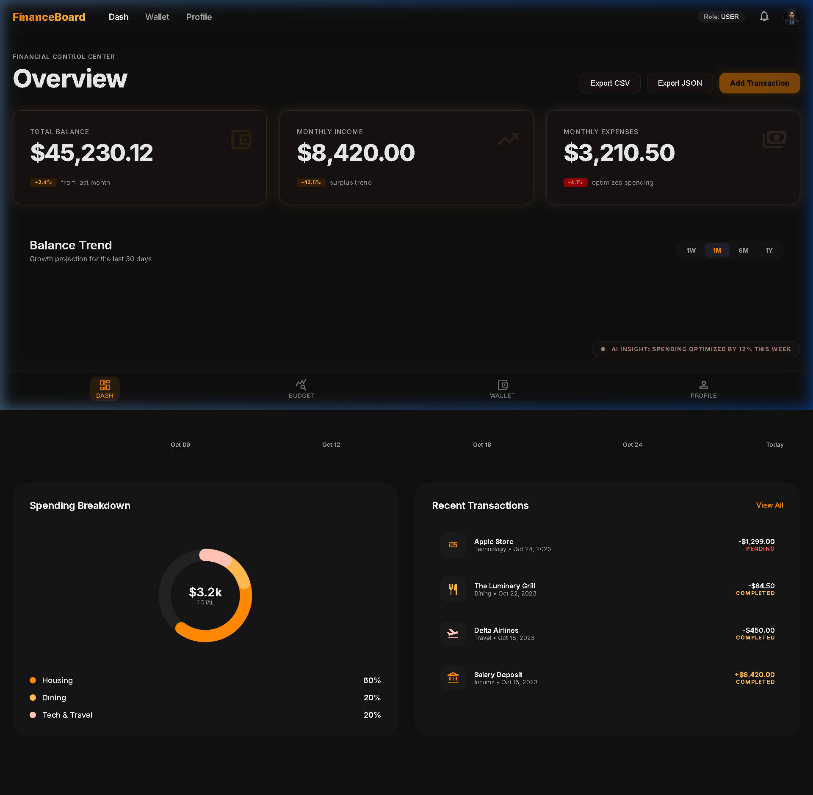

# FinanceHQ

FinanceHQ is a premium, modern finance dashboard application designed with a stunning "Luminescent" dark-themed glassmorphic interface. It provides users with a comprehensive overview of their financial health, budget tracking, wallet management, and account settings.

**Note:** _This project was 80% built by me, with 20% assistance from AI (for mock data generation and UI boilerplate adjustments)._

## 📸 Screenshots



## 🚀 Overview & Approach

The goal of this project was to build a visually striking, highly responsive financial dashboard from 0 to 100 using React.js.

The approach focused heavily on **UI/UX excellence**:
*   **Aesthetics:** Deep dark backgrounds with subtle SVG mesh noise reduction to prevent gradient banding, paired with a vibrant orange/gold primary accent.
*   **Glassmorphism:** Strategic use of `backdrop-filter: blur()`, semi-transparent deep backgrounds, and ultra-thin `1px solid rgba(255, 255, 255, 0.1)` glowing borders to create a realistic frosted glass effect across all cards and modal panels.
*   **Micro-interactions:** Custom `@keyframes` breathing animations (`btn-breathing`) on primary call-to-actions to subtly draw the user's eye without being overwhelming.
*   **Data Visualization:** Custom SVG donut charts and Recharts area charts featuring gradient falloffs for a premium look.

## 📂 Project Structure

```text
financehq-app/
├── public/                 # Static assets (images, fonts, etc.)
│   └── screenshot.png      # Project preview image
├── src/
│   ├── components/         # Reusable UI components
│   │   ├── BalanceTrendChart.jsx      # Recharts area graph for growth projection
│   │   ├── BottomNav.jsx              # Mobile responsive navigation
│   │   ├── BudgetDistributionChart.jsx # Circular distribution visualizer
│   │   ├── CategoryCard.jsx           # Individual budget category breakdown
│   │   ├── Header.jsx                 # Top app bar and desktop navigation
│   │   ├── InsightCard.jsx            # AI-generated financial insights 
│   │   ├── RecentTransactions.jsx     # ListView of recent account activity
│   │   ├── SpendingDonut.jsx          # SVG Donut chart for spending breakdown
│   │   └── SummaryCard.jsx            # Top-level metric cards
│   ├── pages/              # Application Routes/Views
│   │   ├── Budget.jsx                 # Budget planning & categories
│   │   ├── Dashboard.jsx              # Main financial overview center
│   │   ├── Profile.jsx                # User settings and preferences
│   │   └── Wallet.jsx                 # Cards, accounts, and integrations
│   ├── App.jsx             # Main App layout & Routing component
│   ├── contexts.js         # React Context (DataContext, RoleContext) for global state
│   ├── index.css           # Global CSS, CSS variables, and utility classes
│   └── main.jsx            # React mounting point
├── package.json            # Dependencies and scripts
└── vite.config.js          # Build configuration
```

## ✨ Features Working (0 to 100)

*   **Global State Management:** Completely functional global `DataContext` ensuring that newly added transactions, budget categories, and wallet cards dynamically update across all screens in real-time.
*   **Role-Based Access Control (RBAC):** Simulated administrative controls preventing read-only users from adding new budgets or transactions.
*   **Interactive Modals:** Fully styled glassmorphic modals for adding transactions, connecting new bank accounts, and establishing new budget goals.
*   **Responsive Design:** Flawless transition from a robust Desktop sidebar/header view to a mobile-friendly bottom navigation layout.
*   **Data Exporting:** Integrated capabilities for exporting financial data to CSV and JSON formats from the dashboard.

## 🤖 Features & Dummy Data Created by AI

To simulate a fully active financial account, AI was utilized to generate realistic dummy data representing months of financial activity, including:
*   **Mock Transactions:** A diverse mix of completed and pending dummy transactions (e.g., Apple Store, Delta Airlines, Salary Deposits) complete with realistic merchant names, categories, and varying numeric amounts.
*   **Mock Budget Allocations:** Seed data for "Housing", "Dining", "Tech & Travel" to populate the donut and distribution charts.
*   **AI Financial Insights:** The dashboard surfaces generated "AI Insights", highlighting optimized spending habits, smart savings suggestions, and dining alerts powered by the mock spending activity. 

